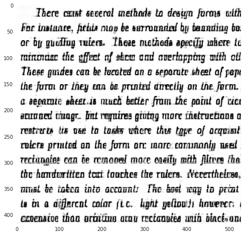

# Denoising-Autoencoders-with-Pytorch

As we know, the photos we take from cameras are sometimes not suitable for processing. In this project, a necessary step was taken in order to achieve maximum efficiency while a project such as text detection was being carried out. This step is to clear the pictures from their noises. A convolutional neural network and autoencoder were used in this project. Have a good time.

<h3 align="center">Noisy picture and clear picture</h1>

<h3 align="center">RESULT</h1>

